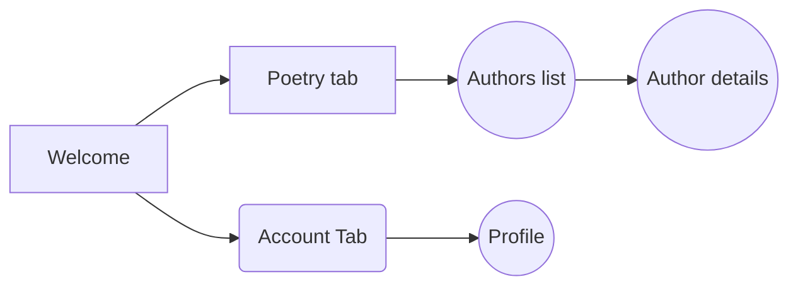

# Petco Android Mobile Tech Test

**Hi Candidate,**  
Welcome to our Android mobile technical test, called _TestWithPoetry_. At Petco, we’ll use this test to evaluate your skills.
In order to evaluated what you have done, you may folk this project and upload your changes in your personal github account.

All your progress will be review in Github so please upload your changes in your folk repository and be sure to create a pull request
ones you finish so we can see your changes.

Best of luck — we believe in you!

# General info
This trial should be build in compose views.

# Instructions
**We’ve already set up something for you.**  We’ve implemented common tools that we use in our daily work in this project. However, feel free to modify any file if is necessary to complete the test, remember in this test you should show all clean architecture and SOLID principles that you know. Be aware project can contain some bugs if you can solve it will be great.

TestWithPoetry already have:
- Ktor
- Dagger hilt
- Room
- Compose
- Compose Navigation
- Serialization

You will have 24 hours to finish this test. Afterward, we’ll have a one-hour meeting where our Android team will ask technical questions for the first 25 minutes. The rest of the meeting will be dedicated to reviewing the code, during which our Android leads will ask questions about what you’ve done.

### Restrictions

You can use any tools from the internet, with one restriction: you cannot use Artificial Intelligence or seek help from other developers. We want to understand how you code, so the code should be entirely yours.

## Acceptance criteria

### Welcome screen
-   This screen should open only the first time the user opens the app.
-   The view should be full screen without bottom or top bars.
-   It should contain a form that fills the project's data class  _localModels.User_.
-   At the bottom of the screen, a button should be displayed:
    -   This button should open **Authors List** (details will be provided in the next section).
    -   Navigation will only happen if the user has filled the form with valid data (don't spend too much time on validations).

### Authors List Screen
-  It should have a top bar with the text "Welcome" and the user's name.
-   There should be a bottom bar with two tabs: Poetry and Account. **Authors list** screen will be hosted in the Poetry tab.
-   A list of authors should be displayed. You can get the authors by calling  `_PoetryRepository.getAuths()_`.
- Every author should be display with a outlined star icon
- If the user taps over the star icon
    - Icon should be change for a fill start icon
    - A toast/snack bar should be display with text "Author added to favorites"
    - Author should be save locally as favorite author
- If the user taps on an author, an  **AuthorDetails**  screen should be displayed.

### Author Details
-  It should have a top bar with the text showing the author's name.
-   There should be a bottom bar with two tabs: Poetry and Account. **Authors Details** screen will be hosted in the Poetry tab.
-   It should display the author's poem titles, which can be retrieved using  `_PoetryRepository.getTitlesByAuthor(authorName)_`  as clickable cards.
-   If the user taps on any poem title, the app should call  `_PoetryRepository.getPoem(authorName, title)_`. Once the call finishes, the poem should be displayed as a dialog.
- Dialog will be display ones `_PoetryRepository.getPoem(authorName, title)_` call finish not before.

### Profile screen
- It should have a top bar with "Profile"  text
- There should be a bottom bar with two tabs: Poetry and Account. **Profile** screen will be hosted in the Account tab.
- It should display user information from the _localModels.User_ model

